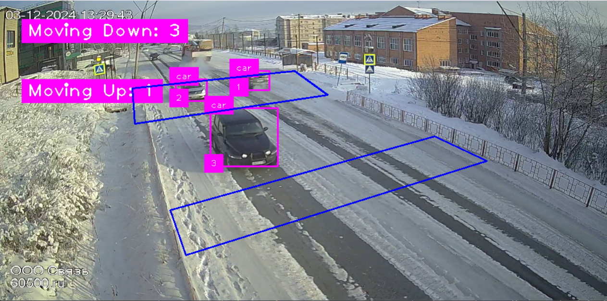

# StreamTrack
StreamTrack is a Python-based tool that combines object detection and tracking using the YOLOv11 model with custom-defined regions of interest (ROIs) for analyzing object movements between predefined areas in a video stream.

## Features
- **Object Detection and Tracking**: Powered by the YOLOv11 model for real-time object tracking.
- **Custom ROIs**: Define and manage custom polylines as regions of interest in the video.
- **Direction Detection**: Track objects moving between predefined regions and count movements.
- **Interactive Polylines**: Draw and name polylines directly on the video feed.
- **Persistent Storage**: Save and load ROI definitions for reuse.

## Installation
1. **Clone the repository**:
    ```bash
    git clone https://github.com/AmmarMohamed0/StreamTrack.git
    cd PolyTrack
    ```

2. **Install dependencies**:
    ```bash
    pip install -r requirements.txt
    ```

3. **Download the YOLOv11 model**:
    Place your YOLOv11 model file (e.g., `yolo11s.pt`) in the project directory.

4. **Prepare COCO class labels**:
    Ensure a `coco.txt` file with COCO dataset class names exists in the project directory.

## Usage
1. **Run the application**:
    ```bash
    python main.py
    ```

2. **Define ROIs**:
   - Left-click on the video to add points to the current ROI (up to 4 points).
   - Press `d` to delete all saved polylines.
   - Press `s` to save the polylines.
   - Press `e` to exit the application.

3. **Track and Analyze**:
   - Objects crossing between ROIs are tracked and labeled in the video stream.
   - Counts of movements between regions are displayed in real time.

## Keybindings
- `e`: Exit the application.
- `s`: Save polylines to file.
- `d`: Delete all saved polylines.
- Left-click: Add points to the current ROI.

## Example Output
  
*Example of object tracking and movement detection.*

## License
This project is licensed under the MIT License. See the [LICENSE](LICENSE) file for details.
